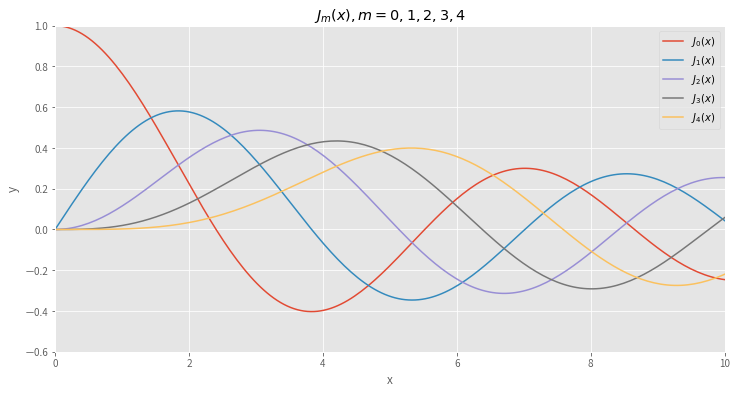
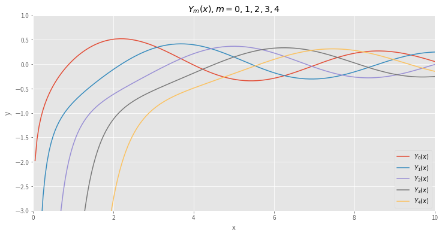
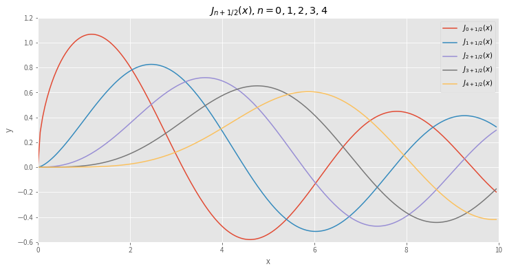
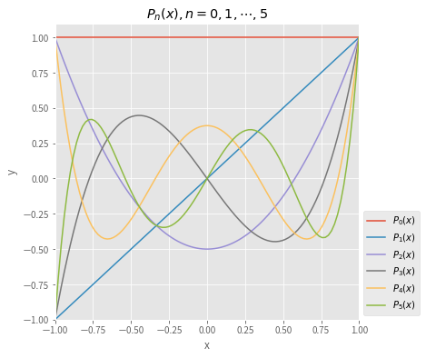

# Chapter 5. Series Solutions of Linear Differential Equations

### Contents

* Solutions about Ordinary Points
* Solutions about Singular Points
* Special Functions

## 5.1 Solutions about Ordinary Points 

* A power series in $x -a$ is an infinite series of the form
  
  >$\displaystyle \sum_{n=0}^\infty c_n(x -a)^n = c_0 +c_1(x -a) +c_2(x -a)^2 +\cdots$
  
  Such a series is also said to be a **power series centered at $a$**
  
  * A power series is **convergent** if its sequence of partial sums converges. 
  
  * Convergence of power series can often
    be determined by the ratio test. Suppose that $c_n \neq 0$ for all $n$, and that
  
    >$\displaystyle \lim_{n \to \infty} \left| \frac{c_{n+1} (x -a)^{n +1}}{c_n (x -a)^n} \right|
       =|x -a| \lim_{n \to \infty} \left| \frac{c_{n +1}}{c_n} \right| =L$
     
    If $L<1$ the series converges absolutely, if $L>1$ the series diverges, and if $L=1$ the test is inconclusive
    
  * Every power series has a **radius of convergence**, $R$. If $R>0$, a power series $\sum_{n=0}^\infty c_n (x -a)^n$ converges for $|x -a| < R$
  
  * A function $f$ ia **analytic** at point $a$ if it can be represented by a power series in $x -a$ with a positive radius of convergence 
  
  * Power series can be combined through the operations of addition, multiplication, and division

* Consider the linear second-order DE

  >$a_2(x) y'' +a_1(x) y' +a_0(x)y = 0,\;\;a_2(x)\neq0$
  
  * Divide by $a_2(x)$ to put into standard form
  
    >$y'' +P(x)y' +Q(x)y = 0$
    
  * Point $x_0$ is an **ordinary point** of the DE if both $P(x)$ and $Q(x)$ are analytic at $x_0$.
    A point that is not an ordinary point is a **singular point** of the equation
    
  * If $x=x_0$ is an ordinary point of the DE, we can always find **two linearly independent solutions** in the form of a power series centered at $x_0$
  
  * A series solution converges at least on some interval defined by $|x -x_0|<R$ where $R$ is the distance from $x_0$ to the closest singular point
  

**Example:** Solve $y' +xy =0$

* Since there are no finite singular points, two power series solutions are guaranteed, centered at $0$, convergent for $|x|>\infty$.
 
* Substituting $y=\sum_{n=0}^\infty c_n x^n$ and the second derivative $y''=\sum_{n=2}^\infty n(n -1) c_n x^{n -2}$
  into the DE gives

  >$
   \displaystyle 
   \begin{align*}
     y'' +xy &= \sum_{n=2}^\infty c_n n(n-1) x^{n -2} +\sum_{n=0}^\infty c_n x^{n +1}\\
     &= 2c_2 +\sum_{k=1}^{\infty} \left[(k +1)(k +2) c_{k +2} +c_{k -1} \right] x^k =0
   \end{align*}
  $
  
  The coefficient of each power of $x$ be set equal to zero:
  
  >$c_2 =0 \;\;\text{and}\;\; \displaystyle c_{k +2} =-\frac{c_{k -1}}{(k+1)(k+2)}, \;k=1,2,3,\cdots$
  
  >$
  \begin{align*}
    c_3 &= -\frac{c_0}{2\cdot3} \\ 
    c_4 &= -\frac{c_1}{3\cdot4} \\ 
    c_5 &= -\frac{c_2}{4\cdot5} = 0 \\ 
    c_6 &= -\frac{c_3}{5\cdot6} = \frac{c_0}{2\cdot3\cdot5\cdot6} \\ 
    c_7 &= -\frac{c_4}{6\cdot7} = \frac{c_1}{3\cdot4\cdot6\cdot7}\\ 
    c_8 &= -\frac{c_5}{7\cdot8} = 0 \\ 
    c_9 &= -\frac{c_6}{8\cdot6} = \frac{c_0}{2\cdot3\cdot5\cdot6\cdot8\cdot9} \\ 
    c_{10} &= -\frac{c_7}{9\cdot7} = \frac{c_1}{3\cdot4\cdot6\cdot7\cdot9\cdot10}\\ 
    c_{11} &= -\frac{c_8}{10\cdot8} = 0 \\ 
    &\;\;\vdots
  \end{align*}
  $
  
  After grouping the terms containing $c_0$ and the terms containing $c_1$, we obtain $y = c_0 y_1(x) +c_1 y_2(x)$
  
  >$
  \begin{align*}
    y_1(x) &= 1 +\sum_{k=1}^\infty \frac{(-1)^k}{2\cdot3 \cdots (3n -1)(3n)}x^{3k}\\ 
    y_2(x) &= x +\sum_{k=1}^\infty \frac{(-1)^k}{3\cdot4 \cdots (3n)(3n +1)}x^{3k +1}
  \end{align*}
  $

### Exercises 5.1

* 1, 3, 9
* 15, 17, 19, 29, 31

## 5.2 Solutions about Singular Points

* Consider the linear second-order DE

  >$(x -x_0)^2 y'' +(x -x_0) p(x) y' +q(x) y = 0$
  
  * Point $x_0$ is a **regular singular point** of the DE if both $p(x)$ and $q(x)$ are analytic at $x_0$.
  
  * A singular point that is not regular is an **irregular singular point** of the equation

* To solve a DE about a regular singular point, we employ **Frobenius' Theorem**

 * If $x_0$ is a regular singular point of the standard DE, there exists **at least one nonzero solution** of the form
 
   >$\displaystyle y=(x -x_0)^r \sum_{n=0}^\infty c_n (x -x_0)^n = \sum_{n=0}^\infty c_n (x -x_0)^{n+r}$
   
   where $r$ is a constant, and the series converges at least on some interval, $0 < x -x_0 < R$
   
 * After substituting $y =\sum_{n=0}^\infty c_n (x -x_0)^{n+r}$ into a DE and simplifying, 
   the **indicial equation** is a quadratic equation in $r$ that results from equating the total coefficient of the lowest power of $x$ to zero
   
 * The **indicial roots** are the solutions to the quadratic equation and are then substituted into a recurrence relation
 
 * **Suppose that $x=x_0$ ia a regular singular point of a DE and the indicial roots are $r_1$ and $r_2$**: $r_1\geq r_2$
 
   * **Case I** 
     
     $r_1$ and $r_2$ are distinct and do not differ by an integer, 
   
     >$
     \begin{align*}
        y_1(x) &= \sum_{n=0}^\infty c_n (x -x_0)^{n +r_1}\\ 
        y_2(x) &= \sum_{n=0}^\infty b_n (x -x_0)^{n +r_2}
     \end{align*}
     $
   
   * **Case II**
   
     $r_1 -r_2 = N$, where $N$ is a positive integer,
     
     >$
     \begin{align*}
        y_1(x) &= \sum_{n=0}^\infty c_n (x -x_0)^{n +r_1}, \; c_0 \neq 0\\ 
        y_2(x) &= Cy_1(x)\ln (x -x_0) +\sum_{n=0}^\infty b_n (x -x_0)^{n +r_2}, \; b_0 \neq 0
     \end{align*}
     $     
     
   * **Case III**
   
     $r_1=r_2$, 
 
     >$
     \begin{align*}
        y_1(x) &= \sum_{n=0}^\infty c_n (x -x_0)^{n +r_1}, \; c_0 \neq 0\\ 
        y_2(x) &= y_1(x)\ln (x -x_0) +\sum_{n=0}^\infty b_n (x -x_0)^{n +r_1}
     \end{align*}
     $ 

 **Example:** Solve $\,2xy'' +(1 +x)y' +y = 0$
 
 * Substituting $y = \sum_{n=0}^\infty c_n x^{n +r}$ gives
 
   >$
   \begin{align*}
    2xy'' +(1 +x)y' +y &= 2\sum_{n=0}^\infty (n +r)(n +r -1)c_n x^{n +r -1}
     +\sum_{n=0}^\infty (n +r) c_n x^{n +r -1}
     +\sum_{n=0}^\infty (n +r) c_n x^{n +r}
     +\sum_{n=0}^\infty c_n x^{n +r}\\ 
     &= x^r\left[r(2r -1) c_0 x^{-1} +\sum_{k=0}^\infty [(k + r +1)(2k +2r +1) c_{k +1} +(k +r +1) c_k] x^k \right] = 0
   \end{align*} 
   $
 
 which implies
 
 >$
 \begin{align*}
   &r(2r -1) = 0\\ 
   &(k + r +1)(2k +2r +1) c_{k +1} +(k +r +1) c_k =0, \;\;k=0,1,\cdots 
 \end{align*} 
 $
 
* We see that the indicial roots are $r_1=\frac{1}{2}$ and $r_2=0$
 
  >$\begin{align*}
    r_1 = \frac{1}{2}, &\;\;c_{k+1} =-\frac{c_k}{2(k +1)}, \;k=0,1,2,\cdots\\ 
    r_2 = 0,\; &\;\;c_{k+1} =-\frac{c_k}{2k +1}, \;k=0,1,2,\cdots
   \end{align*}
  $
  
* For $r_1=\frac{1}{2}$,

  >$
  \begin{align*}
    c_1 &= -\frac{c_0}{2\cdot1}\\ 
    c_2 &= -\frac{c_1}{2\cdot2}=\frac{c_0}{2^2\cdot2!}\\ 
    c_3 &= -\frac{c_2}{2\cdot3}=\frac{-c_0}{2^3\cdot3!}\\ 
    c_4 &= -\frac{c_3}{2\cdot4}=\frac{c_0}{2^4\cdot4!}\\ 
     &\;\vdots \\ 
    c_n &= \frac{(-1)^n c_0}{2^n n!}
  \end{align*}  
  $
  
* For $r_2=0$,

  >$
  \begin{align*}
    c_1 &= -\frac{c_0}{1}\\ 
    c_2 &= -\frac{c_1}{3}=\frac{c_0}{1\cdot3}\\ 
    c_3 &= -\frac{c_2}{5}=\frac{-c_0}{1\cdot3\cdot5}\\ 
    c_4 &= -\frac{c_3}{7}=\frac{c_0}{1\cdot3\cdot5\cdot7}\\ &\;\vdots \\
    c_n &= \frac{(-1)^n c_0}{1\cdot3\cdot5\cdot7\cdots (2n -1)}
  \end{align*}  
  $
  
* The series solutions are

  >$
  \begin{align*}
    y_1(x) &= x^{1/2} \left[ 1 +\sum_{n=1}^\infty \frac{(-1)^n}{2^n n!} x^n \right ]\\ 
    y_2(x) &= 1 +\sum_{n=1}^\infty \frac{(-1)^n}{1\cdot3\cdot5\cdot7\cdots(2n -1)} x^n
  \end{align*}  
  $

### Exercises 5.2

* 1, 3, 5
* 11, 13, 15
* 17, 25, 27, 31

## 5.3 Special Functions

The following DEs occur frequently in advanced studies in applied mathematics, physics, and engineering

* **Bessel's equation of order $\nu$**, solutions are **Bessel functions**

  >$x^2 y'' +xy' +(x^2 -\nu^2) y =0$
  
* **Legendre's equation of order $n$**, solutions are **Legendre functions**

  >$(1 -x^2)y'' -2xy' +n(n +1)y =0$

### 5.3.1 Bessel Functions

Because $x=0$ is a regular singular point of Bessel's equation, there exists at least one solution of the form $y=\sum_{n=0}^\infty c_n x^{n +r}$

>$
\begin{align*}
 x^2 y'' +xy' +(x^2 -\nu^2)y &= \sum_{n=0}^\infty c_n (n +r)(n +r -1) x^{n +r}  
     +\sum_{n=0}^\infty c_n (n +r) x^{n +r}
     +\sum_{n=0}^\infty c_n x^{n +r +2} 
     -\nu^2 \sum_{n=0}^\infty c_n x^{n +r}\\ 
 &= c_0 (r^2 -\nu^2) x^r +x^r \sum_{n=1}^\infty c_n [(n +r)^2 -\nu^2] x^n +x^r \sum_{n=0}^\infty c_n x^{n +2}
\end{align*}
$

The indicial equation is $r^2 -\nu^2=0$ so that the indicial roots are $r_1=\nu$ and $r_2=-\nu$

When $\,r_1=\nu \geq 0$,

>$
\begin{align*}
  x^\nu \sum_{n=1}^\infty &c_n n(n +2\nu) x^n +x^\nu \sum_{n=0}^\infty c_n x^{n +2} \\
     &= x^\nu \left[ (1 +2\nu) c_1 x +\sum_{k=0}^\infty \left[(k +2)(k +2 +2\nu) c_{k+2} 
     +c_k\right]x^{k +2} \right] = 0 \\
     &\Downarrow \\
     c_1 &= 0,\;\; c_{k+2} = \frac{-c_k}{(k +2)(k +2 +2\nu)}, \;\;k=0,1,2,\cdots \\
     &\Downarrow\\
     c_3&=c_5=c_7=\cdots=0,\;\;\text{for}\;k+2 = 2n +1 \\
     c_{2n}&=-\frac{c_{2n -2}}{2^2 n(n +\nu)},\;\;\text{for}\;k+2 = 2n     
\end{align*}
$

Thus

>$
\begin{align*}
    c_2 &= -\frac{c_0}{2^2\cdot1\cdot(1 +\nu)}\\ 
    c_4 &= -\frac{c_2}{2^2\cdot2\cdot(2 +\nu)} = \frac{c_0}{2^4 \cdot 1 \cdot 2(1 +\nu)(2 +\nu)}\\ 
    c_6 &= -\frac{c_4}{2^2\cdot3\cdot(3 +\nu)} =-\frac{c_0}{2^6 \cdot 1 \cdot 2 \cdot 3 (1 +\nu)(2 +\nu)(3 +\nu)}\\ 
        &\;\vdots \\ 
  c_{2n} &= \frac{(-1)^n c_0}{2^{2n} n! (1 +\nu)(2 +\nu)\cdots(n +\nu)}, \;\;n=1,2,3,\cdots\\
         &\;\Bigg\Downarrow \;{\small\text{It is standard practice to choose}}\; c_0=\frac{1}{2^\nu \Gamma(1 +\nu)} \\ 
  c_{2n} &= \frac{(-1)^n}{2^{2n +\nu} n!\, \Gamma(1 +\nu +n)}, \;\;n=1,2,3,\cdots       
\end{align*}
$

> **Note:** $\displaystyle\Gamma(\nu)=\;\int_0^\infty x^{\nu -1} e^{-x} \,dx$, $\;\Gamma(\nu +1)=\nu\Gamma(\nu)$

* **Bessel Functions of the First Kind**

  The series solution $y_1=\sum_{n=0}^\infty c_{2n} x^{2n +\nu}$ is usually denoted by $J_\nu(x)$
  
  >$\displaystyle J_\nu(x)=\sum_{n=0}^\infty \frac{(-1)^n}{n!\, \Gamma(1 +\nu +n)} \left( \frac{x}{2} \right)^{2n +\nu}$
  
  Also, for the second exponent $r_2=-\nu$
  
  >$\displaystyle J_{-\nu(x)}=\sum_{n=0}^\infty \frac{(-1)^n}{n!\, \Gamma(1 -\nu +n)} \left( \frac{x}{2} \right)^{2n -\nu}$
  
    * When $\nu=0$, $J_0(x)$
    
    * When $r_1 -r_2 = 2\nu$ is not positive integer, $J_\nu(x)$ and $J_{-\nu}(x)$ are linearly independent 
    
    * When $r_1 -r_2 = 2\nu$ is positive integer, there are two possibilities
    
      * When $\nu = m =$ positive integer, $J_{-m}(x)$ is a constant multiple of $J_m(x)$
      
      * When $\nu$ is half an odd positive integer, $J_\nu(x)$ and $J_{-\nu}(x)$ are linearly independent 
      
 **Example:** Solve $x^2y'' +xy' +(x^2 -\frac{1}{4})y=0$
  

* **Bessel Functions of the Second Kind**

  If $\nu \neq$ integer
  
  >$\displaystyle Y_\nu(x)=\frac{\cos \nu \pi J_\nu(x) -J_{-\nu}(x)}{\sin \nu \pi}$
  
  $J_\nu(x)$ and $Y_\nu(x)$ are linearly independent solutions of $x^2 y'' +xy' +(x^2 -\nu^2) y =0$
  
  As $\nu \rightarrow m\,(\text{an integer})$,
  
  >$\displaystyle Y_m(x)=\lim_{\nu \to m} Y_\nu(x)$
  
  $J_m(x)$ and $Y_m(x)$ are linearly independent solutions of $x^2 y'' +xy' +(x^2 -m^2) y =0$. 
  
  Hence for *any* value of $\nu$, the general solution of Bessel equation can be written as
  
  >$y=c_1 J_\nu(x) +c_2 Y_\nu(x)$
  
  $Y_\nu(x)$ is called the **Bessel function of the second kind** of order $\nu$ 
  
  **Example:** Solve $x^2y'' +xy' +(x^2 -9)y=0$


* **DEs Solvable in Terms of Bessel Functions**

  * Parametric Bessel equation of order $\nu$
  
    >$
    \begin{align*}
      x^2 y'' +x y' &+(\alpha^2 x^2 -\nu^2) y = 0 \\ 
      &\;\Big\Downarrow \;t=\alpha x, \;\alpha>0 \\
      t^2\frac{d^2y}{dt^2} +t\frac{dy}{dt} &+(t^2 -\nu^2)y = 0 \\
      &\Downarrow \\
      y = c_1 J_\nu(\alpha x) &+c_2 Y_\nu(\alpha x)
    \end{align*}
    $
  
  * Modified Bessel equation of order $\nu$
  
    >$
    \begin{align*}
      x^2 y'' +x y' &-(x^2 +\nu^2) y = 0 \\ 
      &\;\Big\Downarrow \;t=ix \\
      t^2\frac{d^2y}{dt^2} +t\frac{dy}{dt} &+(t^2 -\nu^2)y = 0 \\
      &\;\Big\Downarrow \;I_\nu(x)=i^{-\nu} J_\nu(ix), 
      \;K_\nu(x)=\frac{\pi}{2}\frac{I_{-\nu}(x) -I_{\nu}(x)}{\sin\nu\pi}, \;K_m(x)=\lim_{\nu\to m} K_\nu(x) \\
      y = c_1 I_\nu(x) &+c_2 K_\nu(x)
    \end{align*}
    $
    
  * Yet another equation
  
    >$
     \begin{align*}
       y'' +\frac{1 -2a}{x} y' &+\left( b^2 c^2 x^{2c -2} +\frac{a^2 -p^2 c^2}{x^2}\right)y=0, \;p \geq 0 \\ 
       &\Bigg\Downarrow \;z=bx^c, \;y(x)=\left( \frac{z}{b} \right )^{a/c} w(z)\\ 
       y=x^a [c_1 &J_p(bx^c) +c_2 Y_p(bx^c)] 
     \end{align*}
    $
     
  * The aging spring
  
    >$
     \begin{align*}
       m\ddot{x} &+ke^{-\alpha t}x = 0, \;\alpha > 0 \\ 
       &\,\Bigg\Downarrow \;s = \frac{2}{\alpha} \sqrt{\frac{k}{m}} e^{-\alpha t/2}\\ 
       s^2 \frac{d^2 x}{ds^2} &+s\frac{dx}{ds} +s^2 x = 0
     \end{align*}
    $ 

* **Properties**

  * $J_{-m}(x)=(-1)^m J_m(x)$

  * $J_{m}(-x)=(-1)^m J_m(x)$

  * $J_m(0)=\left\{\begin{matrix} 0, & m > 0\\ 1, & m = 0 \end{matrix}\right.$
             
  * $\displaystyle\lim_{x \to 0^+} Y_m(x)=-\infty$            


```python
%matplotlib inline
import matplotlib.pyplot as plt
plt.style.use('ggplot')

import numpy as np
from scipy.special import jv, yv, spherical_jn, eval_legendre
```


```python
fig = plt.figure(figsize=(12, 6))
ax = fig.add_subplot(111)

x = np.linspace(0, 10, 200)
for m in range(5):
    y = jv(m, x)
    ax.plot(x, y, label=r'$J_%d(x)$' % m)

ax.axis((0, 10, -0.6, 1))    

ax.set_title(r'$J_m(x), m=0,1,2,3,4$')
ax.set_xlabel('x')
ax.set_ylabel('y')
ax.legend()

plt.show()
```





```python
fig = plt.figure(figsize=(12, 6))
ax = fig.add_subplot(111)

for m in range(5):
    y = yv(m, x)
    ax.plot(x, y, label=r'$Y_%d(x)$' % m)

ax.axis((0, 10, -3, 1))    

ax.set_title(r'$Y_m(x), m=0,1,2,3,4$')
ax.set_xlabel('x')
ax.set_ylabel('y')
ax.legend()

plt.show()
```





* **Differential Recurence Relation**

  >$
  \begin{align*}
     xJ_\nu'(x)&= \sum_{n=0}^\infty \frac{(-1)^n(2n +\nu)}{n! \, \Gamma(1 +\nu +n)} 
     \left( \frac{x}{2}\right )^{2n +\nu}\\ 
     &= \nu \sum_{n=0}^\infty \frac{(-1)^n}{n! \, \Gamma(1 +\nu +n)} \left( \frac{x}{2}\right )^{2n +\nu}
     +x\sum_{n=1}^\infty \frac{(-1)^n}{(n -1)! \, \Gamma(1 +\nu +n)} \left( \frac{x}{2}\right )^{2n +\nu -1}\\ 
     &= \nu J_\nu(x) -x\sum_{k=0}^\infty \frac{(-1)^k}{k! \, \Gamma(2 +\nu +k)} 
     \left( \frac{x}{2}\right )^{2k +\nu +1}\\ 
     &= \nu J_\nu(x) -x J_{\nu+1}(x)\\ 
     &\;\big\Downarrow\;\times x^{-\nu -1} \\
     \frac{d}{dx} [x^{-\nu}J_\nu(x)]&=-x^{-\nu} J_{\nu+1}(x)
  \end{align*}  
  $
  
  and
  
  >$
  \begin{align*}
     xJ_\nu'(x)&= -\nu J_\nu(x) +x J_{\nu -1}(x)\\ 
     &\;\big\Downarrow\;\times x^{\nu -1} \\
     \frac{d}{dx} [x^{\nu}J_\nu(x)]&=x^{\nu} J_{\nu -1}(x)
  \end{align*}  
  $ 
  
  **Example:** $J_0'(x)=-J_1(x)$

* **Spherical Bessel Functions:** 
   
  >$\displaystyle j_n(x)=\sqrt{\frac{\pi}{2x}} J_{n +\frac{1}{2}}(x)$ 

  when $\nu=n +\frac{1}{2}$ is half an odd integer, that is, $\pm\frac{1}{2}$, $\pm\frac{3}{2}$,   $\pm\frac{5}{2}$, $\cdots$

  Let's consider the case when $\nu=\frac{1}{2}$,

  >$\displaystyle J_{1/2}(x)=\sum_{n=0}^\infty \frac{(-1)^n}{n!\, \Gamma(1 +\frac{1}{2} +n)} \left( \frac{x}{2} \right)^{2n +1/2}$

  where

  >$
\begin{align*}
 \Gamma\left(\frac{1}{2} \right ) &= \sqrt{\pi}\\
 \Gamma\left(\frac{3}{2} \right ) &= \Gamma\left(1 +\frac{1}{2} \right ) 
    = \frac{1}{2}\Gamma\left(\frac{1}{2} \right )=\frac{1}{2} \sqrt{\pi}\\ 
 \Gamma\left(\frac{5}{2} \right ) &= \Gamma\left(1 +\frac{3}{2} \right ) 
    = \frac{3}{2}\Gamma\left(\frac{3}{2} \right )=\frac{3}{2^2} \sqrt{\pi} 
    = \frac{3\cdot2}{2^3} \sqrt{\pi} = \frac{3!}{2^3} \sqrt{\pi}\\
 \Gamma\left(\frac{7}{2} \right ) &= \Gamma\left(1 +\frac{5}{2} \right ) 
    = \frac{5}{2}\Gamma\left(\frac{5}{2} \right ) = \frac{5\cdot3}{2^3} \sqrt{\pi}
    = \frac{5\cdot4\cdot3\cdot2}{2^3\cdot4\cdot2} \sqrt{\pi} = \frac{5!}{2^5 2!} \sqrt{\pi}\\ 
 \Gamma\left(\frac{9}{2} \right ) &= \Gamma\left(1 +\frac{7}{2} \right ) 
    = \frac{7}{2}\Gamma\left(\frac{7}{2} \right ) = \frac{7\cdot5!}{2^6 2!} \sqrt{\pi}
    = \frac{7\cdot6\cdot5!}{2^6 \cdot6\cdot2!} \sqrt{\pi} = \frac{7!}{2^7 3!} \sqrt{\pi}\\ 
 &\;\vdots \\ 
 \Gamma\left(1 +\frac{1}{2} +n \right ) &= \frac{(2n +1)!}{2^{2n +1} n!} \sqrt{\pi}
\end{align*}
  $

  Hence

  >$\displaystyle J_{1/2}(x)=\sum_{n=0}^\infty \frac{(-1)^n}{n!\, \frac{(2n +1)!}{2^{2n +1} n!} \sqrt{\pi}} \left( \frac{x}{2} \right)^{2n +1/2} = \sqrt{\frac{2}{\pi x}}\sum_{n=0}^\infty \frac{(-1)^n}{(2n +1)!} x^{2n +1} 
=\sqrt{\frac{2}{\pi x}}\sin x$

  Show that

  >$\displaystyle J_{-1/2}(x)=\sqrt{\frac{2}{\pi x}}\cos x$


```python
fig = plt.figure(figsize=(12, 6))
ax = fig.add_subplot(111)

x = x[1:-1]
for n in range(5):
    y = spherical_jn(n, x) /np.sqrt(2/(np.pi *x))
    ax.plot(np.append(0, x), np.append(0, y), label=r'$J_{%d +1/2}(x)$' % n)

ax.axis((0, 10, -0.6, 1.2))    

ax.set_title(r'$J_{n +1/2}(x), n=0,1,2,3,4$')
ax.set_xlabel('x')
ax.set_ylabel('y')
ax.legend()

plt.show()
```





### 5.3.2 Legendre Functions

Since $x=0$ is an ordinary point of Legendre's equation, we substitute the series $y=\sum_{k=0}^\infty c_k x^k$ to get

>$
\begin{align*}
(1 -x^2)y'' -2xy' +n(n +1)y &= [n(n+1)c_0 +2c_2] +[(n -1)(n +2)c_1 +6c_3]x \\
     &+\sum_{j=2}^\infty [(j +2)(j +1) c_{j +2} +(n -j)(n +j +1)c_j] x^j = 0\\ 
 &\Downarrow \\ 
 c_2&= -\frac{n(n+1)}{2} c_0\\ 
 c_3&= -\frac{(n -1)(n +2)}{6} c_1\\
 c_{j +2} &=-\frac{(n -j)(n +j +1)}{(j +2)(j +1)} c_j, \;\; j=2,3,4,\cdots
\end{align*}
$

The recurrence relation yields

>$
\begin{align*}
 c_2&= -\frac{n(n+1)}{2!} c_0\\ 
 c_4&= -\frac{(n -2)(n +3)}{4\cdot3}c_2=\frac{(n -2)n(n+1)(n +3)}{4!} c_0\\ 
 c_6&= -\frac{(n -4)(n +5)}{6\cdot5}c_4=-\frac{(n -4)(n -2)n(n+1)(n +3)(n +5)}{6!} c_0\\ 
  &\;\,\vdots
\end{align*}
$

>$
\begin{align*}
 c_3&= -\frac{(n -1)(n+2)}{3!} c_1\\ 
 c_5&= -\frac{(n -3)(n +4)}{5\cdot4}c_3=\frac{(n -3)(n -1)(n+2)(n +4)}{5!} c_1\\ 
 c_7&= -\frac{(n -5)(n +6)}{7\cdot6}c_5=-\frac{(n -5)(n -3)(n -1)(n+2)(n +4)(n +6)}{7!} c_1\\ 
  &\;\,\vdots
\end{align*}
$


Thus for at least $|x|<1$, we obtain two linearly independent power series solutions:

>$\displaystyle
y_1(x) = c_0 \left[1 -\frac{n(n+1)}{2!} x^2 +\frac{(n -2)n(n+1)(n +3)}{4!} x^4 -\frac{(n -4)(n -2)n(n+1)(n +3)(n +5)}{6!} x^6 \cdots \right]
$

>$\displaystyle
y_2(x) = c_1 \left[x -\frac{(n -1)(n+2)}{3!} x^3 +\frac{(n -3)(n -1)(n+2)(n +4)}{5!} x^5 
 -\frac{(n -5)(n -3)(n -1)(n+2)(n +4)(n +6)}{7!} x^7 \cdots \right]
$

If $n$ is an even integer, the series $y_1(x)$ reduces to a polynomial of degree $n$ with only even powers of $x$ and the series $y_2(x)$ diverges. If $n$ is an odd integer, the series $y_2(x)$ reduces to a polynomial of degree $n$ with only odd powers of $x$ and the series $y_1(x)$ diverges. The general solution for an integer $n$ is then given by the **polynomials**. For example, if $n=4$, then

>$
y_1(x) = c_0 \left[1 -\frac{4\cdot5}{2!} x^2 +\frac{2\cdot4\cdot5\cdot7}{4!} x^4 \right]
 = c_0 \left[1 -10x^2 +\frac{35}{3} x^4 \right]
$

It is traditional to choose
specific values for $c_0$ or $c_1$, depending on whether $n$ is an even or odd positive integer, respectively.

* For $n=0$, $c_0=1$, and for $n=2,4,6,\cdots$

  >$\displaystyle
   c_0=(-1)^{n/2} \frac{1\cdot 3\cdots (n -1)}{2 \cdot 4 \cdots n}
  $
  
* For $n=1$, $c_1=1$, and for $n=3,5,7,\cdots$

  >$\displaystyle
   c_0=(-1)^{(n -1)/2} \frac{1\cdot 3\cdots n}{2 \cdot 4 \cdots (n -1)}
  $ 
  
For example, when $n=4$, we have

>$
y_1(x) = (-1)^{4/2} \frac{1\cdot3}{2\cdot4} \left[1 -10x^2 +\frac{35}{3} x^4 \right]
  =\frac{1}{8} (35x^4 -30x^2 +3)
$  

* **Legendre Polynomials**

  There specific $n$-th degree polynomials are called **Legendre polynomials** and denoted by $P_n(x)$

  >$
  \begin{align*}
    P_0(x) &= 1\\ 
    P_1(x) &= x\\ 
    P_2(x) &= \frac{1}{2}(3x^2 -1)\\ 
    P_3(x) &= \frac{1}{2}(5x^3-3x)\\ 
    P_4(x) &= \frac{1}{8}(35x^4 -30x^2 +3)\\
    P_5(x) &= \frac{1}{8}(63x^5 -70x^3 +15x)
  \end{align*}
  $


```python
fig = plt.figure(figsize=(6, 6))
ax = fig.add_subplot(111)

x = np.linspace(-1, 1, 100)
for n in range(6):
    y = eval_legendre(n, x)
    ax.plot(x, y, label=r'$P_{%d}(x)$' % n)

ax.axis((-1, 1, -1, 1.1))    

ax.set_title(r'$P_n(x), n=0,1,\cdots,5$')
ax.set_xlabel('x')
ax.set_ylabel('y')
ax.legend(loc='lower left', bbox_to_anchor=(1, 0))

plt.show()    
```





* **Properties**

  * $P_n(-x)=(-1)^n P_n(x)$
  * $P_n(1)=1$
  * $P_n(-1)=(-1)^n$
  * $P_n(0)=0$, $n$ odd
  * $P_n'(0)=0$, $n$ even

* **Rodrigues' Formula**

    The Legendre polynomials can also be represented using **Rodrigues’ Formula**,

    >$\displaystyle P_n(x)=\frac{1}{2^n n!} \frac{d^n}{dx^n} \left(x^2 -1\right)^n,\;(\text{RF})$

    This can be demonstrated through the following observations

    * The right hand side of (RF) is a $n$-th order polynomial

    * Treating $\left(x^2 -1\right)^n = (x -1)^n (x + 1)^n$ as a product and using Leibnitz’ rule to differentiate $n$ times, we have
    
    >$\displaystyle\frac{d^n}{dx^n} (x -1)^n (x +1)^n = n!(x+1)^n + \text{terms with } (x -1) \text{ as a factor}$
    
    so that $\displaystyle P_n(1) = \frac{n! 2^n}{2^n n!} =1$
   
    * Since, if $h(x) = \left(1 -x^2\right)^n$, then $h'(x) = -2nx(1 -x^2)^{n-1}$, so that

    >$\left(1 -x^2\right)h' + 2nxh = 0$
    
    Now differentiate $n +1$ times, using Leibnitz, to get
    
    >$
    \displaystyle 
    \begin{align*}
      \left(1 -x^2\right)h^{n +2} &-2(n +1)x h^{n +1} -2\frac{(n + 1)n}{2} h^n + 2nxh^{n +1} + 2n(n + 1)h^n = 0 \\
      &\Downarrow\\
      \left(1 -x^2\right)h^{n +2} &-2x h^{n +1} +n(n +1) h^n = 0
    \end{align*}
    $

    As the equation is linear and $P_n(x) \propto h^n(x)$, $P_n(x)$ satisfies the Legendre equation of order $n$
    
    >$\left(1 -x^2\right) P_n''(x) -2x P_n'(x) +n(n +1) P_n(x) = 0$

* **Integral Relations** - *optional*

  We consider the function $B(a, b)$ defined by
  
  >$\displaystyle B(a, b)=\int_0^1 t^a (1 -t)^b\,dt$
  
  A partial integration shows
  
  >$\displaystyle
   B(a, b)=\int_0^1 t^a (1 -t)^b\,dt=\frac{b}{a +1} \int_0^1 t^{a +1} (1 -t)^{b -1}\,dt
   =\frac{b}{a +1} B(a +1, b -1)
  $
   
  Since $\displaystyle B(a +b, 0)=\frac{1}{a +b +1}$, it then follows rather easily
  
  >$\displaystyle 
    \begin{align*}
     B(a,b)&= \frac{b}{a +1} B(a+1,b-1)\\ 
     &= \frac{b}{a +1} \frac{b-1}{a +2} B(a+2,b-2)\\ 
     &= \frac{b}{a +1} \frac{b-1}{a +2} \frac{b-2}{a +3} B(a+3, b-3)\\ 
     &\;\vdots \\ 
     &= \frac{b}{a +1} \frac{b-1}{a +2} \frac{b-2}{a +3} \cdots \frac{1}{a +b} B(a+b,0) \\
     &= \frac{a! b!}{(a +b +1)!}
    \end{align*}$
    
   Then we deduce
   
   >$
   \begin{align*}
   \int_{-1}^1 (1 -x^2)^l\, dx &= \int_{-1}^1 (1 +x)^l (1 -x)^l\, dx\\ 
   &\;\big\Downarrow \; x= 2t-1 \\ 
   &= 2^{2l +1} \int_0^1 t^l (1 -t)^l\, dt\\ 
   &= 2^{2l +1} B(l,l) \\
   &= 2^{2l +1} \frac{l!l!}{(2l+1)!}
   \end{align*}
   $
   
   **Let us now show that**
   
   >$\displaystyle
    \int_{-1}^1 P_k(x) P_l(x) \,dx = \delta_{k,l} \frac{2}{2l +1},\;\;k \leq l
   $
   
   Plugging Rodrigues' formula, we have
   
   >$\displaystyle
    \int_{-1}^1 P_k(x) P_l(x) \,dx 
    =\frac{1}{2^{k +l} k! l!} \int_{-1}^1 \frac{d^k}{dx^k} \left(x^2 -1\right)^k
    \frac{d^l}{dx^l} \left(x^2 -1\right)^l \,dx
   $
   
   Since $\displaystyle\frac{d^a}{dx^a} \left(x^2 -1\right)^b$ vanishes at $x = \pm 1$ if $a < b$, partial integration leads to
   
   >$\displaystyle
    \int_{-1}^1 P_k(x) P_l(x) \,dx 
    =\frac{(-1)^l}{2^{k +l} k! l!} \int_{-1}^1 \frac{d^{k +1}}{dx^{k +l}} \left(x^2 -1\right)^k 
    \cdot\left(x^2 -1\right)^l \,dx
   $
   
   If $k \neq l$, we may assume $l > k$ and then $\displaystyle \frac{d^{k+l}}{dx^{k +l}}(x^2 − 1)^k = 0$.
   Hence the integral vanishes. When $k = l$, we use 
   
   >$\displaystyle \frac{d^{2l}}{dx^{2l}}(x^2 -1)^l = \frac{d^{2l}}{dx^{2l}}x^{2l}=(2l)!\;$
   and $\;\left(x^2 -1\right)^l=(-1)^l \left(1 -x^2\right)^l $
   
   to find
   
   >$
    \displaystyle
    \int_{-1}^1 P_l^2(x) \,dx 
    =\frac{(2l)!}{2^{2l} l! l!} \int_{-1}^1 \left(1 -x^2\right)^l \,dx =\frac{2}{2l +1}
   $
   
   **Let us now show that**
   
   >$
    \displaystyle
    \int_{-1}^1 x P_s(x) P_r(x) \,dx = \delta_{r,s +1} \frac{2r}{(2r -1)(2r +1)}, \; r \geq s 
   $
   
   First we consider the case that $r = s$. In this case the integral is easily found to be zero:
   $P_r$ has parity $(-1)^r$, and thus $x(P_r)^2$ has parity $-1$. Therefore the integral over 
   the symmetric interval $[-1,\; 1]$ vanishes.
   
   Now we consider the case $r > s$. We find, using Rodrigues' formula, partial integration
   and $(xf)^{(n)} = xf^{(n)}+nf^{(n -1)}$,
 
   >$
   \displaystyle
   \begin{align*}
    \int_{-1}^1 x P_s(x) P_r(x) \,dx &= \frac{1}{2^{s +r} s! r!} \int_{-1}^1 x \frac{d^s}{dx^s}
    \left(x^2 -1\right)^s \frac{d^r}{dx^r} \left(x^2 -1\right)^r \,dx\\
    &=\frac{(-1)^r}{2^{s +r} s! r!} \int_{-1}^1
    \left[ x \frac{d^{s +r}}{dx^{s +r}} \left(x^2 -1\right)^s 
    +r\frac{d^{s +r -1}}{dx^{s +r -1}} \left(x^2 -1\right)^s \right] \left(x^2 -1\right)^r \,dx
   \end{align*}
   $
   
   We see that the first term vanishes since $r > s$; the second term only survives if $r -1 \leq s$.
   Hence we need only consider the case $s = r -1$.
   
   >$
    \displaystyle
    \begin{align*}
     \int_{-1}^1 x P_{r -1}(x) P_r(x) \,dx 
     =\frac{(-1)^r}{2^{2r-1} (r -1)! r!} \int_{-1}^1 \left[ r \frac{d^{2r -2}}{dx^{2r -2}} 
     \left(x^2 -1\right)^{r -1} \right ] \left(x^2 -1\right)^r \,dx
    \end{align*}
   $
   
   We find, again using Rodrigues' formula, partial integration and $(xf)^{(n)} = xf^{(n)}+nf^{(n -1)}$,
   but also that the $(2r -2)$-th derivative of $(x^2 -1)^{r -1}$ equals $(2r -2)!$, that
   
   >$\displaystyle
    \begin{align*}
     \int_{-1}^1 x P_{r -1}(x) P_r(x) \,dx 
     =\frac{r(2r -2)!}{2^{2r-1} (r -1)! r!} \int_{-1}^1 \left(1 -x^2\right)^r \,dx
     =\frac{2r}{(2r -1)(2r +1)}
    \end{align*}
   $   

* **Recurrence Relation**

  The Legendre polynomials satisfy the following recurrence relation

  >$(n + 1) P_{n +1}(x) = (2n + 1) x P_n(x) -n P_{n -1}(x)$
  
  Consider the polynomial $x P_n(x)$. It has degree $n +1$ and is thus in the linear span
  of $P_0, \cdots, P_{n +1}$. We can hence write $x P_n(x)$ as a linear combination of the first $n +2$
  Legendre polynomials:
  
  >$
   xP_n(x) = c_0 P_0(x) +c_1 P_1(x) +\cdots +c_{n +1}P_{n +1}(x)
  $
  
  Thus
  
  >$
   \displaystyle
   \int_{-1}^1 x P_n(x) P_k(x)\,dx = c_k \int_{-1}^1 P_k^2(x)\, dx 
   \rightarrow c_k=\frac{2k +1}{2} \int_{-1}^1 x P_n(x) P_k(x)\,dx
  $
  
  These integrals vanish unless $k = n \pm 1$ and for this case, we can use
   
  >$
   \displaystyle
   c_{n -1}=\frac{2n -1}{2} \int_{-1}^1 x P_n(x) P_{n -1}(x)\,dx=\frac{n}{2n +1}
  $
   
  >$
   \displaystyle
   c_{n +1}=\frac{2n +3}{2} \int_{-1}^1 x P_n(x) P_{n +1}(x)\,dx=\frac{n +1}{2n +1}
  $
   
  Hence

  >$
   \displaystyle
   xP_n(x) = c_{n -1} P_{n -1}(x) +c_{n +1}P_{n +1}(x)=\frac{n}{2n +1}P_{n -1}(x)+\frac{n +1}{2n +1}P_{n +1}(x)
  $
  
  This is what we wanted to prove

### Exercises 5.3

* 1, 3, 5
* 7, 9, 11, 13
* 21, 22, 23
* 27, 28, 29, 30
* 33, 38, 41
* 51, 52, 53, 54
